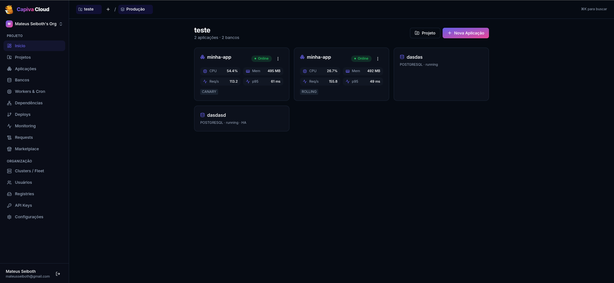
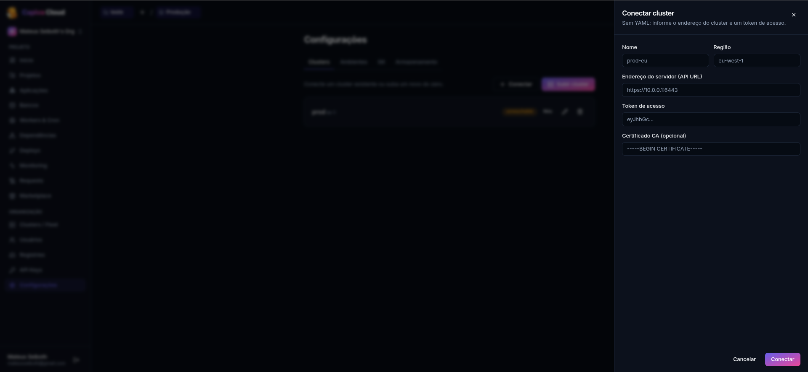
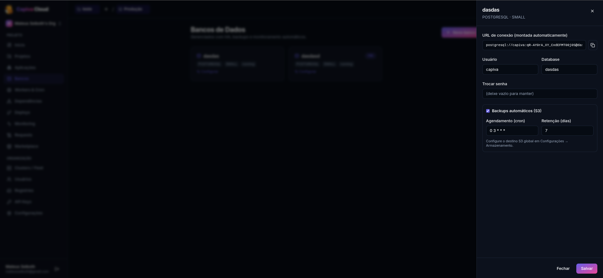
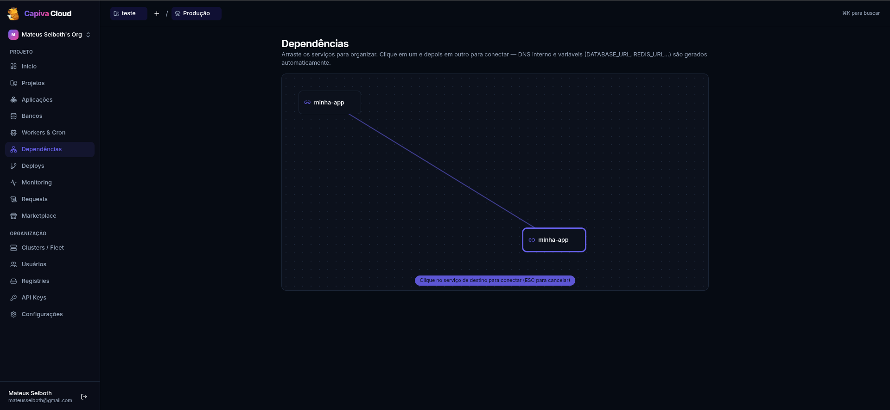

<div align="center">
  

# Capiva Cloud

### Kubernetes without Kubernetes

Deploy applications, databases, workers and cron jobs through a visual interface. No YAML, no kubectl, and no Kubernetes expertise required.

</div>

## App Preview

<p align="center">
  
</p>

<p align="center">
  
</p>

<p align="center">
  
</p>

<p align="center">
  
</p>

---

## ✨ What is Capiva Cloud?

**Capiva Cloud** is a deployment platform built on top of a multi-cluster Kubernetes infrastructure.

The goal is simple: create your project using a guided setup wizard, choose what you need, and let the platform handle everything else.

Instead of dealing with deployments, networking, storage, certificates, scaling and cluster operations, you simply configure your application through the UI and Capiva Cloud takes care of the underlying infrastructure.

During project creation, you can select:

- Git repository
- Application type
- Database services
- Domains
- Resource profiles
- Deployment preferences

Once the setup is complete, Capiva Cloud automatically provisions, configures and manages the required infrastructure.

SSL certificates, networking, storage, backups, scaling, monitoring and service connectivity are handled automatically behind the scenes.

The capybara represents what the platform aims to be: calm, reliable infrastructure that simply works.

## 🎯 Who is it for?

Capiva Cloud is designed for developers, startups and small teams that want to deploy production-ready applications without becoming Kubernetes experts.

Focus on building software. Let the platform handle the infrastructure.

## 🧩 Key Features

- Deploy applications from GitHub, GitLab, Gitea or Docker images.
- Guided project creation wizard inspired by tools like Dokploy.
- Automatic stack detection and build configuration.
- Simple resource profiles (Nano, Small, Medium, Large and XLarge).
- Automatic scaling when needed.
- Custom domains with automatic TLS provisioning.
- One-click service marketplace.
- Managed databases with high availability and automated backups.
- Automatic service discovery and application integration.
- Continuous deployment from Git repositories.
- Automatic rollback support.
- Zero-downtime deployment strategies.
- Built-in logs and metrics.
- Organizations, teams and environments.
- Multi-cluster architecture.
- Secure by default.

### Distributed Storage

Persistent storage is powered by **Longhorn**.

Volumes are automatically replicated across cluster nodes, providing high availability, resilience and reliable storage for applications, databases and internal platform services.

## 🏗️ Architecture

```text
capiva-cloud/
├── backend/    # Bun + Express + @mateusseiboth/ts-decorators + Prisma 7
├── frontend/   # React + TanStack Query + Zustand + React Hook Form + Zod
└── docs/       # Architecture, workflows and technical documentation
```

The platform is composed of three main layers:

- **Frontend** responsible for the user experience.
- **Backend** responsible for business logic, authentication and infrastructure orchestration.
- **Reconciliation Engine** responsible for keeping clusters aligned with the desired project state.

All Kubernetes complexity remains hidden from end users.

## 🚀 How It Works

1. Create a new project.
2. Follow the setup wizard.
3. Choose your repository, services, domains and resources.
4. Click deploy.

Capiva Cloud provisions and configures everything automatically.

Whenever new code is pushed to your repository, the platform can build, deploy and roll back changes automatically according to your deployment settings.

No Kubernetes manifests, no kubectl commands and no cluster administration required.
