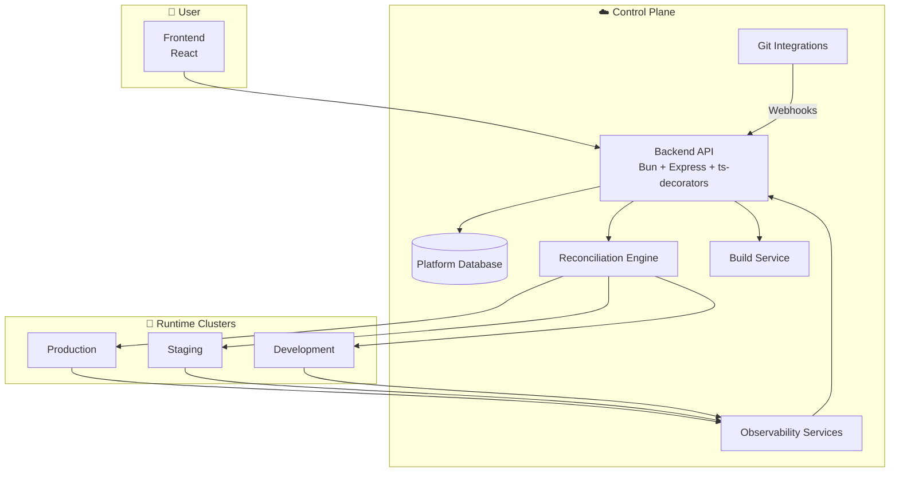
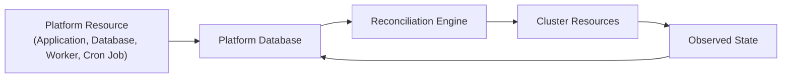
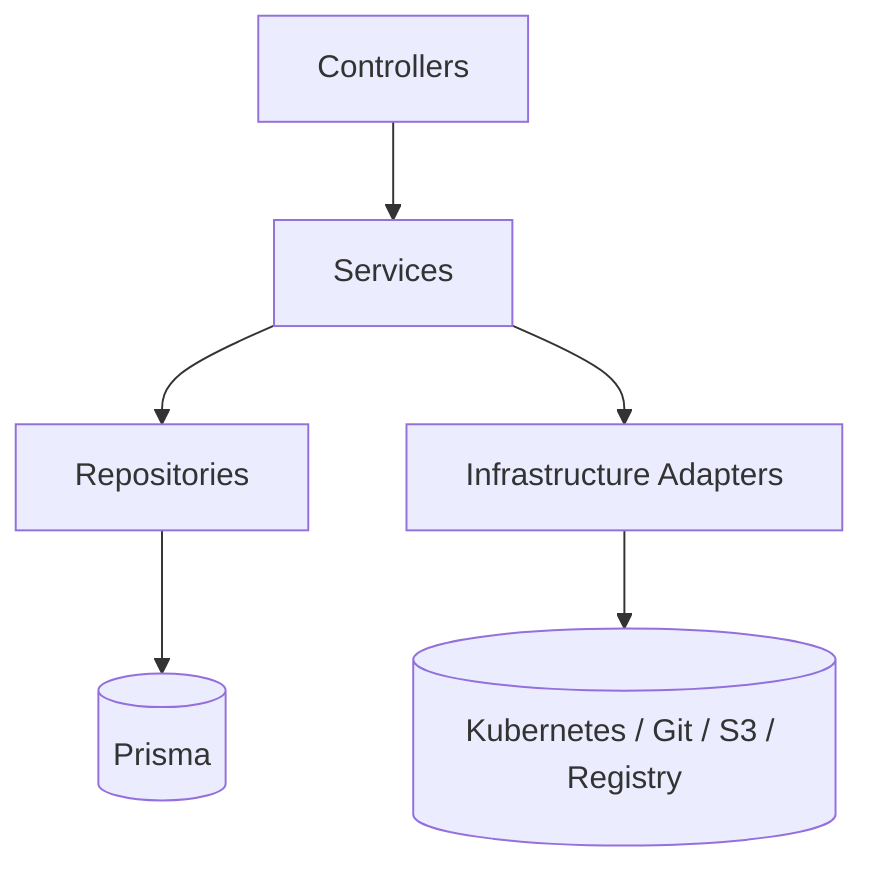

# 02 — System Architecture

## High-Level Overview

Capiva Cloud consists of a centralized control plane responsible for managing applications, services and infrastructure across one or more Kubernetes clusters.

Users interact exclusively with the platform interface while the control plane translates platform resources into infrastructure resources and continuously keeps both states synchronized.

---

## Core Components

| Component             | Responsibility                                                      | Technology                                           |
| --------------------- | ------------------------------------------------------------------- | ---------------------------------------------------- |
| Frontend              | User interface, setup wizards, dashboards and service relationships | React, TanStack Query, Zustand, Tailwind, ShadCN     |
| Backend API           | Business rules, authentication, authorization and orchestration     | Bun, Express, `@mateusseiboth/ts-decorators`, Prisma |
| Reconciliation Engine | Synchronizes platform resources with cluster resources              | TypeScript, `@kubernetes/client-node`                |
| Build Service         | Builds container images from source code                            | Kaniko, Buildpacks, Nixpacks                         |
| Container Registry    | Stores generated images                                             | Harbor or compatible OCI registry                    |
| Deployment Engine     | Progressive delivery and deployment strategies                      | Argo Rollouts                                        |
| Networking Layer      | Routing, DNS and TLS management                                     | Gateway API, cert-manager, external-dns              |
| Managed Services      | Databases, cache and messaging systems                              | CloudNativePG, MySQL Operators, Redis Operators      |
| Observability Stack   | Logs, metrics and tracing                                           | Loki, Prometheus, OpenTelemetry                      |
| Backup Layer          | Backups and disaster recovery                                       | Velero, pgBackRest, xtrabackup                       |
| Distributed Storage   | Persistent volumes and storage replication                          | Longhorn                                             |

---

## Desired State Reconciliation

Capiva Cloud follows a declarative architecture.

Users define the desired state of their applications through the platform interface. The reconciliation engine continuously compares the desired state stored in the control plane with the actual state running in clusters and performs the necessary actions to keep both aligned.

This model provides:

- Idempotent operations
- Automatic recovery from drift
- Consistent infrastructure provisioning
- Continuous synchronization between platform and runtime environments

---

## Layered Architecture

### Responsibilities

#### Controllers

Responsible for:

- HTTP request handling
- Input validation
- Authentication and authorization checks
- Invoking services

Controllers contain no business logic.

#### Services

Responsible for:

- Business rules
- Workflow orchestration
- Transaction boundaries
- Cross-domain operations

All business logic lives in services.

#### Repositories

Responsible for:

- Data persistence
- Database queries
- Prisma access

Prisma should only be used within repositories.

#### Infrastructure Adapters

Responsible for communication with external systems such as:

- Kubernetes
- Git providers
- Object storage
- Container registries
- Build systems

External integrations are exposed through interfaces and can be replaced without affecting business logic.

---

## Real-Time Communication

The platform uses WebSocket and Server-Sent Events (SSE) for:

- Deployment progress
- Log streaming
- Resource status updates
- Build events
- Deployment timelines

Frontend state synchronization is handled through TanStack Query with reactive cache invalidation.

---

## Multi-Cluster Architecture

A single control plane can manage multiple Kubernetes clusters simultaneously.

Each environment is mapped to a target cluster and namespace:

| Environment | Cluster             |
| ----------- | ------------------- |
| Development | Development Cluster |
| Staging     | Staging Cluster     |
| Production  | Production Cluster  |

Cluster credentials are managed by the control plane and used by the reconciliation engine when applying infrastructure changes.

See [High Availability & Multi-Cluster Architecture](./10-alta-disponibilidade-multicluster.md)
for implementation details.
