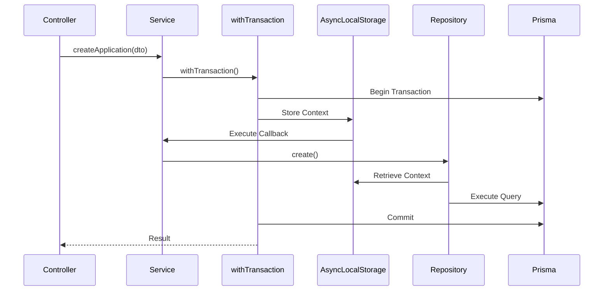

# 03 — Backend Architecture

## Related Documents

- [System Architecture](./02-arquitetura.md)
- [Frontend Architecture](./04-arquitetura-frontend.md)
- [Data Model](./05-modelo-de-dados.md)
- [Security & Multi-Tenancy](./11-seguranca-multitenant.md)

---

## Technology Stack

| Area                   | Technology                     |
| ---------------------- | ------------------------------ |
| Runtime                | Bun                            |
| Language               | TypeScript                     |
| HTTP Server            | Express 5                      |
| Internal Framework     | `@mateusseiboth/ts-decorators` |
| ORM                    | Prisma 7                       |
| Validation             | Zod                            |
| API Documentation      | OpenAPI 3.1 + Scalar           |
| Kubernetes Integration | `@kubernetes/client-node`      |
| Observability          | OpenTelemetry                  |

---

## Database Provider Support

Database providers can be selected through environment variables.

```env
DATABASE_PROVIDER=postgresql
DATABASE_URL=postgresql://...
```

Supported providers:

- PostgreSQL
- MySQL
- SQLite

PostgreSQL is the recommended option for production deployments due to its feature set, JSON support and overall performance characteristics.

SQLite is primarily intended for local development and single-node installations.

See [Data Model](./05-data-model.md) for entity definitions and schema design.

---

## Architectural Rules

The backend follows a strict layered architecture.

| Layer                  | Responsibilities                                  | Restrictions            |
| ---------------------- | ------------------------------------------------- | ----------------------- |
| Controller             | HTTP handling, input validation, response mapping | No business logic       |
| Service                | Business rules, orchestration, transactions       | No direct Prisma access |
| Repository             | Data persistence and queries                      | No business logic       |
| Infrastructure Adapter | External integrations                             | No business logic       |
| Model                  | Data structures and Prisma mappings               | No business logic       |

### Core Principles

- Business rules belong exclusively in services.
- Prisma is only used within repositories.
- External systems are accessed through adapters and interfaces.
- Transaction boundaries are controlled by services.
- Controllers remain thin and focused on HTTP concerns.

---

## Project Structure

### `backend/src`

```text
src/
├── index.ts
├── config.ts
├── bootstrap/
├── http/
├── controller/
├── service/
├── repository/
├── model/
├── schemas/
├── auth/
├── database/
├── infra/
├── middlewares/
├── di/
├── functions/
├── interfaces/
└── openapi/
```

### Important Directories

| Directory      | Purpose                                   |
| -------------- | ----------------------------------------- |
| `controller/`  | HTTP controllers                          |
| `service/`     | Business logic and orchestration          |
| `repository/`  | Database access layer                     |
| `model/`       | Prisma-backed models                      |
| `schemas/`     | Zod schemas and API contracts             |
| `auth/`        | Authentication and session management     |
| `infra/`       | External integrations                     |
| `middlewares/` | Request pipeline and context management   |
| `interfaces/`  | Dependency inversion contracts            |
| `openapi/`     | OpenAPI generation and Scalar integration |

The service layer is considered the core of the application and contains all domain-level business logic.

---

## Dependency Injection

Dependency injection is provided through `@mateusseiboth/ts-decorators`.

Services depend on interfaces rather than concrete implementations, allowing providers to be replaced without affecting business logic.

```ts
@Injectable()
export class ApplicationService {
  constructor(
    private readonly apps: ApplicationRepository,
    private readonly reconciler: IResourceReconciler,
    private readonly git: IGitProviderFactory,
  ) {}
}
```

Benefits include:

- Easier testing
- Mockable integrations
- Provider abstraction
- Reduced coupling

---

## Transaction Management

Capiva Cloud uses a custom `withTransaction()` abstraction.

Unlike framework-specific transaction helpers, this implementation is designed to work consistently across all supported database providers.

### Features

- PostgreSQL support
- MySQL support
- SQLite support
- AsyncLocalStorage propagation
- Multi-tenant context propagation
- Extensible audit integration
- Automatic transaction sharing across repositories

### Example

```ts
await withTransaction(
  async (ctx) => {
    const app = await this.apps.create(dto);

    await this.audit.record(ctx, "app.created", app);

    return app;
  },
  {
    tenant: {
      organizationId,
    },
  },
);
```

### Transaction Flow



This mechanism ensures that all database operations within a request share the same transaction context.

Additional details can be found in [Data Model](./05-data-model.md).

---

## API Documentation

The API documentation is generated automatically.

### Source of Truth

Zod schemas define:

- Request payloads
- Response payloads
- Validation rules

### Documentation Pipeline

```text
Zod Schema
    ↓
OpenAPI 3.1
    ↓
Scalar UI
```

The generated documentation is available through `/docs`.

No manual OpenAPI maintenance is required.

---

## Authentication & Sessions

Authentication is documented in detail in [Security & Multi-Tenancy](./11-security-multitenancy.md).

### Summary

#### Access Token

- JWT (RS256)
- 15-minute expiration
- Contains user and session claims

#### Refresh Token

- Opaque token
- Cookie-only
- Rotated on every use
- Stored as SHA-256 hash

#### Sessions

- Multi-device support
- Session revocation
- Reuse detection
- Device fingerprinting
- Audit logging

#### Password Storage

- Argon2id
- Implemented using `Bun.password`

---

## Testing

Testing is considered a required part of the development process.

### Principles

- No refactoring without test coverage.
- Services should be tested independently from infrastructure.
- External dependencies should be mocked through interfaces.
- Repository and adapter implementations should be tested separately.

### Tooling

```bash
bun test
```

The dependency injection architecture allows services to be tested without requiring real databases, Kubernetes clusters or external providers.

---

## Next Steps

Continue with:

1. [Frontend Architecture](./04-arquitetura-frontend.md)
2. [Data Model](./05-modelo-de-dados.md)
3. [Infrastructure Architecture](./06-arquitetura-kubernetes.md)
