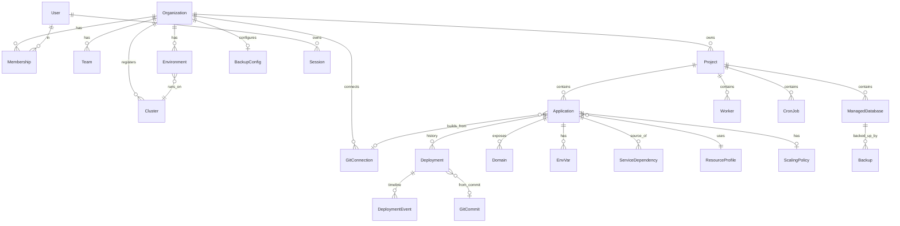

# 05 — Data Model

## Related Documents

- [02-arquitetura.md](./02-arquitetura.md)
- [03-arquitetura-backend.md](./03-arquitetura-backend.md)
- [06-arquitetura-kubernetes.md](./06-arquitetura-kubernetes.md)
- [10-alta-disponibilidade-multicluster.md](./10-alta-disponibilidade-multicluster.md)
- [11-seguranca-multitenant.md](./11-seguranca-multitenant.md)
- [12-bancos-de-dados.md](./12-bancos-de-dados.md)

---

## Source of Truth

The definitive source of truth for the data model is:

```text id="alcn4z"
backend/prisma/schema.prisma
```

This document explains the purpose and relationships of entities but should never be treated as authoritative over the Prisma schema.

Models should implement Prisma-generated types whenever possible.

---

## Multi-Tenant Hierarchy

```text id="zqzhwj"
Organization
├── Members
├── Teams
├── Environments
├── Git Connections
├── Clusters
├── Projects
│   ├── Applications
│   ├── Managed Databases
│   ├── Workers
│   └── Cron Jobs
└── Backup Configuration
```

An organization represents the root tenant boundary.

All deployable resources, infrastructure resources and permissions belong to an organization.

---

## Entity Relationship Diagram



---

## Core Entities

### Identity & Multi-Tenancy

| Entity         | Description                            | Key Fields                                          |
| -------------- | -------------------------------------- | --------------------------------------------------- |
| `User`         | Global user account                    | `id`, `email`, `name`, `passwordHash`               |
| `Organization` | Root tenant boundary                   | `id`, `name`, `slug`                                |
| `Membership`   | User membership within an organization | `userId`, `organizationId`, `role`                  |
| `Team`         | Organizational subgroup                | `id`, `organizationId`, `name`                      |
| `Session`      | Refresh token session                  | `id`, `userId`, `tokenHash`, `expiresAt`, `revoked` |
| `AuditLog`     | Security and operational events        | `event`, `userId`, `sessionId`, `at`, `detail`      |

Authentication and session management are documented in [11-seguranca-multitenant.md](./11-seguranca-multitenant.md).

---

### Infrastructure

| Entity            | Description                                   |
| ----------------- | --------------------------------------------- |
| `Cluster`         | Registered Kubernetes cluster and credentials |
| `Environment`     | Maps workloads to a cluster and namespace     |
| `ResourceProfile` | User-facing resource presets (Nano → XLarge)  |
| `BackupConfig`    | Organization-wide backup configuration        |

Cluster architecture is described in [10-alta-disponibilidade-multicluster.md](./10-alta-disponibilidade-multicluster.md).

---

### Applications & Deployments

| Entity              | Description                           |
| ------------------- | ------------------------------------- |
| `Project`           | Groups related resources and services |
| `Application`       | Deployable application                |
| `Deployment`        | Deployment execution record           |
| `DeploymentEvent`   | Timeline entry within a deployment    |
| `GitConnection`     | Source control integration            |
| `GitCommit`         | Tracked commit metadata               |
| `Domain`            | Custom domain configuration           |
| `EnvVar`            | Environment variable or secret        |
| `ScalingPolicy`     | Autoscaling configuration             |
| `ServiceDependency` | Relationship between services         |

Deployment workflows are documented in [13-deploy-intelligence.md](./13-deploy-intelligence.md).

---

### Managed Services

| Entity            | Description                    |
| ----------------- | ------------------------------ |
| `ManagedDatabase` | Managed infrastructure service |
| `Worker`          | Background processing workload |
| `CronJob`         | Scheduled workload             |
| `Backup`          | Backup execution record        |

Managed service implementations are described in [12-bancos-de-dados.md](./12-bancos-de-dados.md).

---

## Design Notes

### Encryption

Sensitive information is encrypted at rest.

Examples include:

- Kubernetes credentials
- Git access tokens
- Application secrets
- Backup credentials
- Object storage credentials

Encryption uses AES-GCM with a control plane managed key or external KMS integration.

---

### Auditing

Domain entities should include:

```text id="4vhk3j"
createdAt
updatedAt
```

Important actions should generate audit events through `AuditLog`.

---

### Identifier Strategy

Domain entities should use:

- `cuid()`
- `uuid()`

Sequential identifiers should be avoided to reduce resource enumeration risks.

Refresh tokens are never stored directly.

Only SHA-256 hashes are persisted.

---

### Multi-Database Compatibility

The schema is intentionally designed to remain compatible with:

- PostgreSQL
- MySQL
- SQLite

Database-specific features should be avoided unless a provider-specific implementation exists.

Flexible configuration data should be stored using JSON fields.

---

### Desired State vs Observed State

Resources such as:

- Applications
- Databases
- Workers
- Cron Jobs

store both:

| Field Type     | Purpose                             |
| -------------- | ----------------------------------- |
| Desired State  | User-defined configuration          |
| Observed State | Runtime status reported by clusters |

This separation allows the reconciliation engine to detect drift and continuously converge resources toward their intended state.

See [06-arquitetura-kubernetes.md](./06-arquitetura-kubernetes.md) for reconciliation details.

---

## Next Steps

Continue with:

1. [06-arquitetura-kubernetes.md](./06-arquitetura-kubernetes.md)
2. [07-fluxos.md](./07-fluxos.md)
3. [11-seguranca-multitenant.md](./11-seguranca-multitenant.md)
