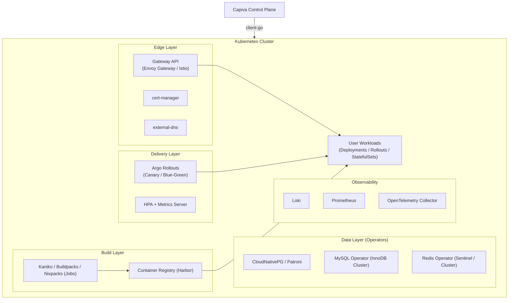
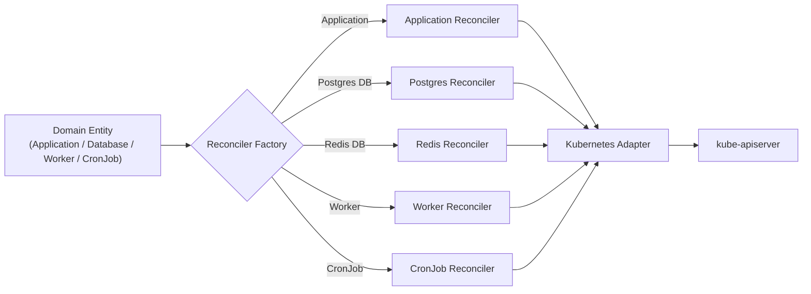

# 06 — Kubernetes Architecture

## Related Documents

- [02-arquitetura.md](./02-arquitetura.md)
- [03-arquitetura-backend.md](./03-arquitetura-backend.md)
- [05-modelo-de-dados.md](./05-modelo-de-dados.md)
- [10-alta-disponibilidade-multicluster.md](./10-alta-disponibilidade-multicluster.md)
- [13-deploy-intelligence.md](./13-deploy-intelligence.md)

---

## Core Principle

The platform prioritizes **battle-tested Kubernetes components** from the ecosystem.

Capiva Cloud focuses on:

- UX
- Automation
- Abstraction

It does **not** reinvent Kubernetes primitives.

---

## User Concepts vs Kubernetes Resources

| User Concept                     | Kubernetes Resources (hidden)                                   |
| -------------------------------- | --------------------------------------------------------------- |
| Application                      | `Deployment` or `Rollout` (Argo), `Service`, `ServiceAccount`   |
| Domain                           | `HTTPRoute` (Gateway API) + `Certificate` + `external-dns`      |
| Scaling (min/max + metrics)      | `HorizontalPodAutoscaler` + metrics-server / Prometheus Adapter |
| Resource Profile (Nano → XLarge) | `resources.requests` / `limits`                                 |
| Environment Variable / Secret    | `ConfigMap` / `Secret`                                          |
| Managed Database                 | `StatefulSet` or Operator CR + `PVC` + headless `Service`       |
| Service Dependency Graph         | DNS + injected env vars + `NetworkPolicy`                       |
| Deployment Strategy              | `Rollout` (Argo Rollouts) + `AnalysisTemplate`                  |
| Worker / CronJob                 | `Deployment` / `CronJob`                                        |
| High Availability Database       | Operators (CloudNativePG / Patroni / InnoDB / Redis Sentinel)   |

None of these Kubernetes resources are exposed in the UI.

---

## Cluster Architecture

---

## Platform Components (Battle-tested Stack)

| Domain               | Component                                    | Reason                                                         |
| -------------------- | -------------------------------------------- | -------------------------------------------------------------- |
| Ingress / Routing    | Gateway API (Envoy Gateway / Istio)          | Modern standard, supports traffic splitting and canary routing |
| TLS                  | cert-manager                                 | Automatic TLS via Let's Encrypt or custom certificates         |
| DNS                  | external-dns                                 | Automatic DNS record management                                |
| Progressive Delivery | Argo Rollouts                                | Canary / Blue-Green / automated rollback                       |
| Image Builds         | Kaniko / Cloud Native Buildpacks / Nixpacks  | Dockerless builds inside cluster                               |
| Registry             | Harbor                                       | Image registry with scanning (Trivy)                           |
| PostgreSQL HA        | CloudNativePG / Patroni                      | Mature operator ecosystem                                      |
| MySQL HA             | MySQL Operator (InnoDB Cluster)              | Group replication and routing                                  |
| Redis HA             | Redis Operator                               | Sentinel or clustered topologies                               |
| Backups              | Velero + DB-native tools                     | Snapshots + S3 backups                                         |
| Metrics              | Prometheus + kube-state-metrics              | Standard Kubernetes observability                              |
| Logs                 | Loki                                         | Lightweight log aggregation                                    |
| Tracing              | OpenTelemetry Collector                      | Distributed tracing                                            |
| Secrets              | External Secrets / Sealed Secrets (optional) | Secure secret management                                       |

---

## Reconciliation Engine

The backend translates domain entities into Kubernetes resources using a **Factory + Strategy-based reconciler system**.

### Core Interfaces

- `IResourceReconciler`
  - `reconcile(spec) → observedStatus`
  - `delete(spec)`

- `KubernetesAdapter`
  - Wraps `@kubernetes/client-node`
  - Handles apply/patch/watch operations
  - Manages cluster communication

---

## Design Principles

### Idempotency

All reconciliation is declarative:

- Desired state is always re-applied
- No stored imperative command history
- Cluster is continuously converged

---

### Observability Loop

1. Desired state stored in control plane
2. Reconciler applies Kubernetes resources
3. Informers/watch detect real cluster state
4. Observed state updates back into domain entities
5. UI reflects live status

---

## Why Kubernetes

Kubernetes is chosen because:

- Mature ecosystem of operators for HA databases
- Native support for multi-cluster architectures
- Strong ecosystem for progressive delivery (Argo Rollouts)
- Portability across cloud and on-prem environments
- Existing tooling for networking, storage and observability

The platform’s value is not replacing Kubernetes, but **making it invisible**.

---

## Multi-Cluster Execution

Each `Environment` maps to a specific `Cluster`.

The `KubernetesAdapter` is instantiated per cluster using encrypted kubeconfig credentials.

Cluster strategy and failover behavior are described in:
[10-alta-disponibilidade-multicluster.md](./10-alta-disponibilidade-multicluster.md)

---

## Next Steps

Continue with:

1. [07-fluxos.md](./07-fluxos.md)
2. [10-alta-disponibilidade-multicluster.md](./10-alta-disponibilidade-multicluster.md)
3. [13-deploy-intelligence.md](./13-deploy-intelligence.md)
