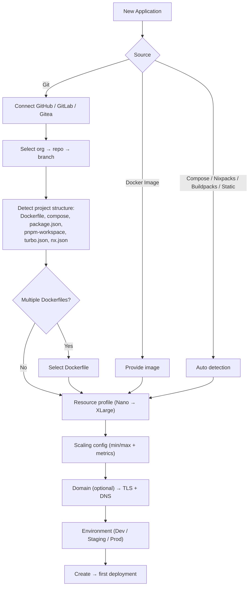
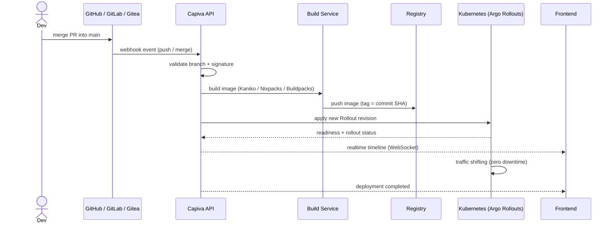
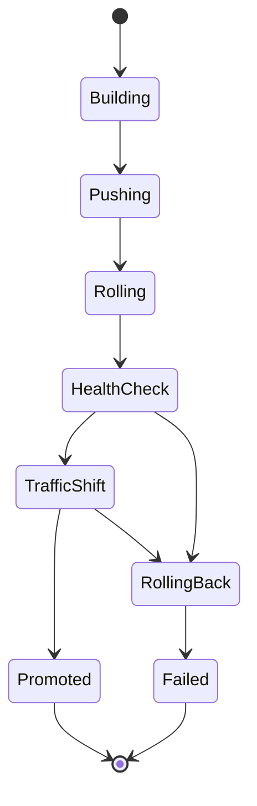
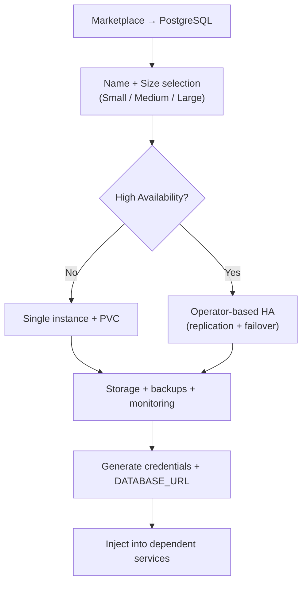
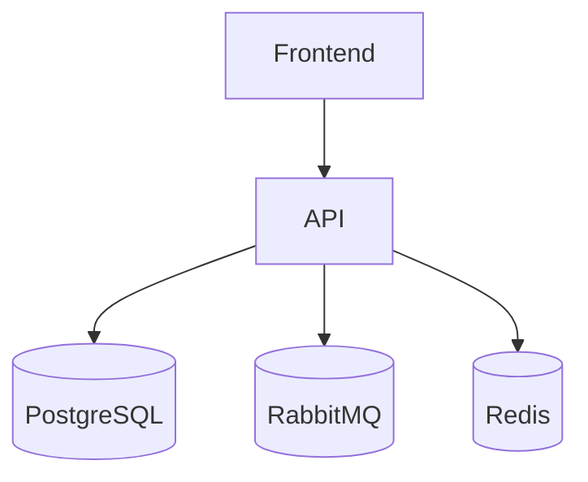
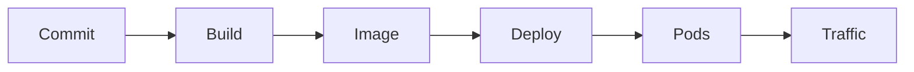
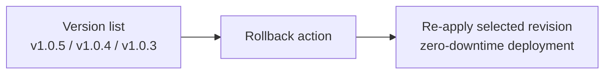

# 07 — Workflows

---

## 1. New Application (Wizard)

The platform applies sensible defaults at every step.

Advanced mode allows full manual control (CPU, memory, storage).

---

## 2. Automatic Deployment (Git → Production)

This flow is identical across GitHub, GitLab and Gitea.

No user intervention is required after initial setup.

---

## 3. Zero Downtime + Smart Rollback

### Automatic rollback triggers

- Health check failure
- Increased error rate
- Latency spike
- Crash loops
- Startup failures

When triggered, traffic is immediately routed back to the previous stable version and the deployment is marked as failed.

---

## 4. Managed Service Provisioning (e.g. PostgreSQL)

Users never interact with StatefulSets, replicas, or operators directly.

They only decide whether HA is enabled.

---

## 5. Service Dependency Graph

When dependencies are created (drag-and-drop):

1. Internal DNS is configured automatically
2. Environment variables are generated (`DATABASE_URL`, `REDIS_URL`, etc.)
3. Variables are injected into dependent services
4. Startup order is handled when required

---

## 6. Deployment Traceability (Commit → Production)

The UI provides full traceability per commit:

- Author
- Branch / PR
- Deployment status
- Environment (Dev / Staging / Prod)
- Pod status
- Deployment history

Also available:

- Rollback history
- Deploy frequency
- Commit → production latency
- Failure rate per service

---

## 7. Manual Rollback

Rollback is treated as a standard deployment with a previous revision.

---

## Next Steps

Continue with:

1. [08-wireframes.md](./08-wireframes.md)
2. [10-alta-disponibilidade-multicluster.md](./10-alta-disponibilidade-multicluster.md)
3. [13-deploy-intelligence.md](./13-deploy-intelligence.md)
