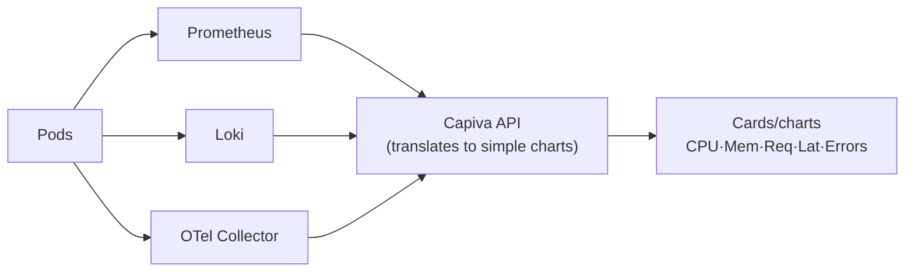

## 09 — Observability

Goal: deep operational visibility **without exposing PromQL, Grafana, or cluster internals**.

## Logs (Railway-style)

- Collection: **Loki** + **Promtail / Grafana Alloy** per node.
- Live streaming via WebSocket/SSE in the **Logs** tab.
- Available per container, per deployment, and per project.
- Simple filters (text, level, time range). No LogQL exposed. Queries are built internally by the backend.

## Metrics (simple charts)

- Collection: **Prometheus** + **kube-state-metrics** + **metrics-server**.
- Rendered as ready-made charts: **CPU, memory, requests, latency (p95), errors**.
- No PromQL exposed to users; backend translates each chart into internal queries.

## Tracing

- **OpenTelemetry Collector** gathers traces from applications and from the control plane itself.
- Used internally for **release tracking** (request → pod → deployment → image → commit → PR).

## Alerts & Smart Rollback

- Health signals (errors, latency spikes, crash loops) feed into **Argo Rollouts AnalysisTemplates** and the **automatic rollback engine**.
- Alerts become UI notifications (plus optional Slack/webhooks).

## Core principle

All complexity (PromQL, LogQL, Grafana, dashboards) stays hidden inside the system. The user only sees numbers and charts that actually make sense instead of a cryptic query language hobby.
