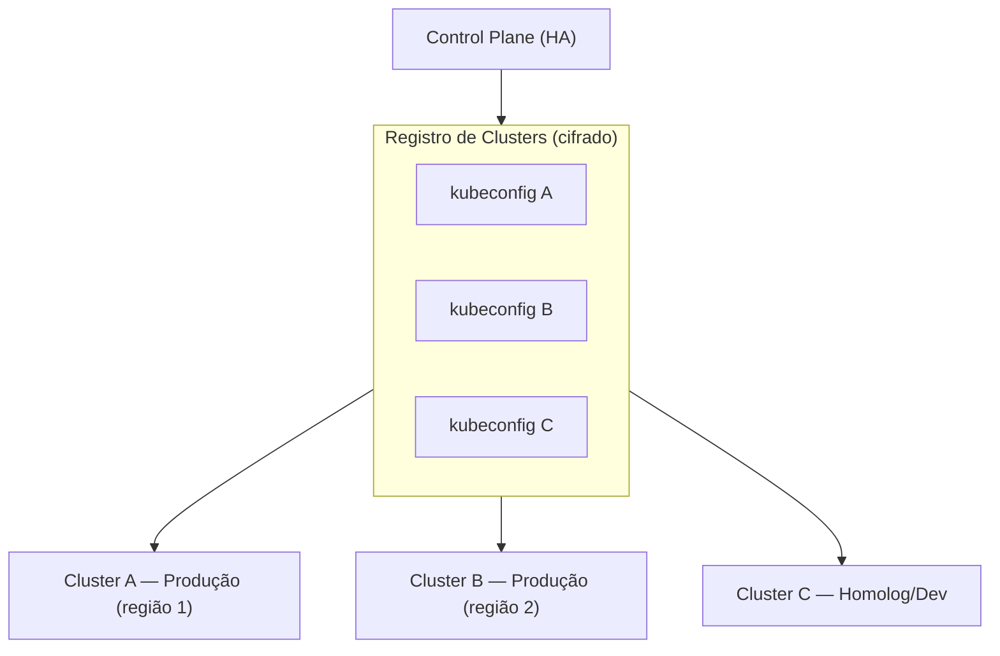

# 10 — Alta Disponibilidade & Multi-Cluster

## HA do Control Plane

- Backend **stateless** → N réplicas atrás de load balancer.
- Sessões **persistidas** (Prisma), não em memória → qualquer réplica atende qualquer request.
- Banco do control plane em HA (Postgres com CloudNativePG/Patroni).
- Reconcilers idempotentes → seguro rodar concorrente (lock otimista por entidade).
- Build/Reconcile como **jobs** assíncronos (fila), permitindo retry.

## HA dos workloads do usuário

- `min ≥ 2` réplicas por padrão em Produção.
- `PodDisruptionBudget` + `topologySpreadConstraints` (espalha entre nós/zonas) — gerados automaticamente.
- Health/readiness/liveness probes derivados da app (ou defaults sensatos).
- Bancos gerenciados em HA via operators (ver [Bancos de Dados](./12-bancos-de-dados.md)).

## Multi-cluster

- Cada **Environment** referencia um **Cluster** + namespace.
- `KubernetesAdapter` instanciado por cluster (credenciais cifradas em repouso).
- **Fleet view:** visão agregada de todos os clusters (capacidade, saúde, custo).
- Estratégias de distribuição:
  - **Ambiente por cluster** (Dev/Homolog/Prod isolados) — padrão.
  - **Geo-redundância** (mesma app em 2 clusters/regiões) com DNS global (external-dns + health-based failover).
- Falha de cluster: o control plane continua; deploys são roteados para clusters saudáveis; alertas na Fleet view.

## Backups & DR

- Backups de bancos → **S3 global** (config da org), com retenção e restore por 1 clique.
- **Velero** para snapshots de PVCs/recursos (incl. restore cross-cluster).
- Estratégia de DR documentada por ambiente (RPO/RTO configuráveis por tamanho do banco).

## Resiliência de deploy

- Zero-downtime por padrão (Argo Rollouts).
- Rollback automático em degradação.
- Quotas e limites por tenant evitam _noisy neighbor_ entre organizações.
