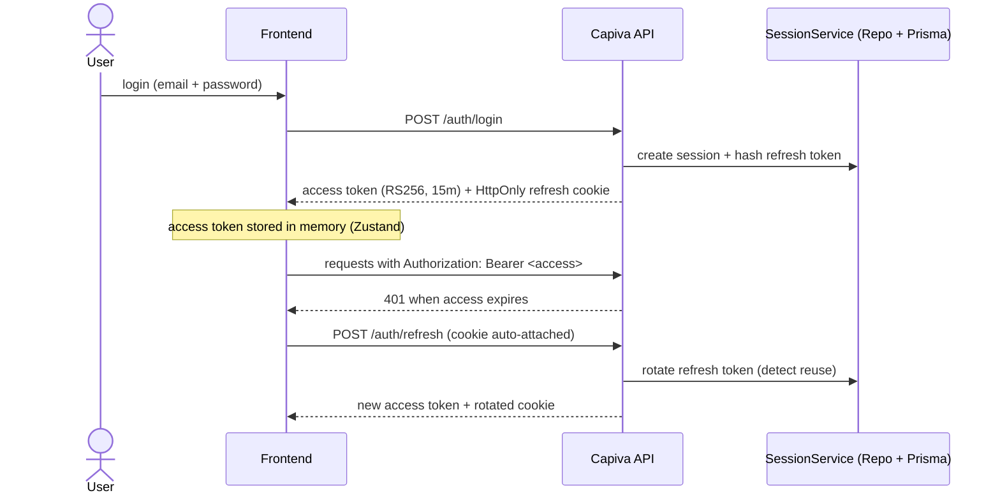

## 11 — Security & Multi-Tenant

Security is **default-on**: TLS, secrets, RBAC, tenant isolation, image scanning, backups.

## Multi-tenant model

```
Organization (tenant)
 ├── Membership (Role: OWNER | ADMIN | DEVELOPER | VIEWER)
 ├── Team
 └── Environment (Dev | Staging | Prod)
```

- Logical isolation in the control plane (every query is scoped by `organizationId`).
- Cluster-level isolation:
  - **namespace per (org × environment)**
  - `NetworkPolicy`
  - `ResourceQuota`
  - Kubernetes RBAC per namespace

- Future-ready for **Row-Level Security (RLS)** in the control plane database (Postgres). The `withTransaction` layer already injects tenant context for this.

## Application RBAC

| Role          | Permissions                                       |
| ------------- | ------------------------------------------------- |
| **Owner**     | Full access + billing + org deletion              |
| **Admin**     | Manage projects, members, clusters, environments  |
| **Developer** | Create/deploy apps & databases, view logs/metrics |
| **Viewer**    | Read-only access                                  |

Authorization is enforced via `@RequireRole` / `rbac` middleware at route + resource level.

## Authentication & sessions (short-lived + cookie refresh)

> Based on `mateus-main/src/auth`, adapted to be repository-backed (not in-memory).



### Access token

- JWT **RS256**, short-lived (**15 minutes** via `ACCESS_TOKEN_TTL`).
- Claims: `sub`, `email`, `name`, `sid` (session id), `iss`, `aud`.
- Verified with **public key only**; private key never leaves control plane.
- Middleware validates both:
  - signature
  - session status (`sid` still active → instant revocation support)

### Refresh token (cookie-only)

- High entropy opaque token (not JWT), ~48 bytes random (`base64url`).
- Cookie flags:
  - `HttpOnly`
  - `Secure`
  - `SameSite=Strict`
  - `Path=/auth`

- Stored only as **SHA-256 hash** (raw token never persisted).
- Rotated on every use.
- TTL configurable (default: 7 days).

### Session security model

- **Reuse detection**: if an already-rotated refresh token is reused → assume theft:
  - revoke all sessions for user
  - emit audit event

- **Multi-device sessions** supported (one session per device)
- Full session revocation:
  - per session (logout)
  - global (kill switch)

- Device fingerprint: hashed IP + User-Agent (audit only)
- Audit log tracks: LOGIN / LOGOUT / REFRESH / REUSE_DETECTED / REVOKE_ALL

### Passwords

- Stored using **Argon2id** (`Bun.password`)
- OWASP-aligned parameters (memory-hard, slow hash, resistant to GPU attacks)

## Secrets & encryption

- Sensitive data (kubeconfigs, Git tokens, app secrets, S3 keys):
  - encrypted at rest using **AES-256-GCM**
  - keys managed by control plane KMS or equivalent secret manager

- Kubernetes layer:
  - standard `Secret`
  - optional **Sealed Secrets / External Secrets** for GitOps setups

## Image security scanning

- Images scanned via **Trivy** (integrated in Harbor pipeline).
- Policy enforcement:
  - critical vulnerabilities can block deployment (configurable per org/environment)

## Network & TLS

- Automatic TLS via **cert-manager + Let's Encrypt** (or manual certificate upload).
- Default-deny `NetworkPolicy` between namespaces.
- Service-to-service communication only allowed through explicitly defined dependencies (dependency graph enforcement).

## Hardening practices

- Git webhook validation via signed secrets
- Rate limiting (`@RateLimit`) on sensitive endpoints
- Idempotency protection (`@Idempotent`) for critical operations
- Strict CORS + security headers by default
