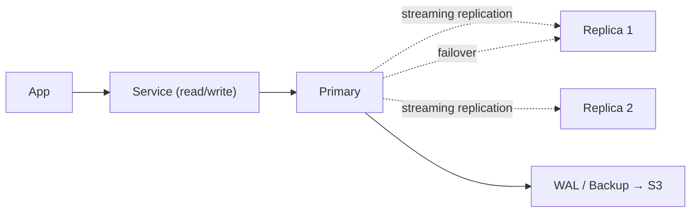
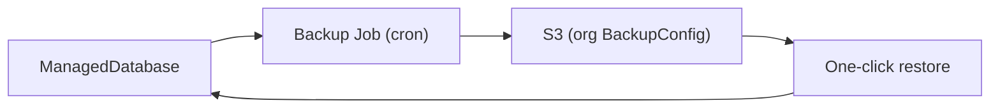

## 12 — Managed Databases

Users only define **Name + Size** (and optionally **[✓] High Availability**). The platform handles everything else: persistence, S3 backups, monitoring, failover, replication. No exposure of StatefulSets, Patroni, pgpool, routers, or any of that noise.

## Size tiers → resources (profiles)

| Size   | CPU      | Memory | Disk (default) |
| ------ | -------- | ------ | -------------- |
| Small  | 0.5 vCPU | 1 GB   | 10 GB          |
| Medium | 1 vCPU   | 4 GB   | 50 GB          |
| Large  | 2+ vCPU  | 8+ GB  | 100+ GB        |

## PostgreSQL

- **Recommended operator:** **CloudNativePG** (alternative: Patroni).
- Single mode: 1 instance + PVC + automated S3 backups.
- **HA mode ([✓]):**
  - streaming replication with multiple replicas
  - automatic failover and leader election
  - continuous WAL archiving to S3
  - fully managed by CloudNativePG (or Patroni fallback)

- Everything automatic: persistence, backups, metrics, replication, failover.

## MySQL

- **Architecture:** **InnoDB Cluster** (Group Replication + MySQL Router)
- Managed via MySQL Operator
- Why:
  - official Oracle-supported stack
  - built-in failover
  - consistent replication model
  - transparent routing via MySQL Router

- HA mode uses 3-node quorum cluster; single node for dev.

## Redis

- Simple mode: single instance
- **HA mode:**
  - **Redis Sentinel** for most workloads (master/replica + automatic failover)
  - **Redis Cluster** when horizontal scaling/sharding is required

- Operator manages topology automatically depending on workload profile

## Other marketplace services

| Service       | Strategy                         |
| ------------- | -------------------------------- |
| RabbitMQ      | Cluster Operator (quorum queues) |
| Kafka         | Strimzi Operator (KRaft mode)    |
| MinIO         | MinIO Operator (erasure coding)  |
| Elasticsearch | ECK Operator                     |
| ClickHouse    | Altinity Operator                |

## Backups (global S3)

- Global per-organization **BackupConfig**:
  - S3 endpoint
  - bucket
  - encrypted credentials

- Automated scheduled backups + retention policies
- One-click restore to any point in time (when supported)

## Connectivity & injection

When a service is linked to a database via the dependency graph:

- platform generates connection strings (`DATABASE_URL`, `REDIS_URL`, etc.)
- injects them automatically into the app environment
- credentials are encrypted at rest
- internal DNS resolves service-to-service traffic
- values can be overridden explicitly if needed

Everything stays invisible on purpose. The user sees “connect database”, not a distributed systems lecture.
