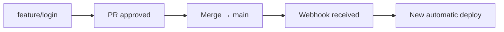
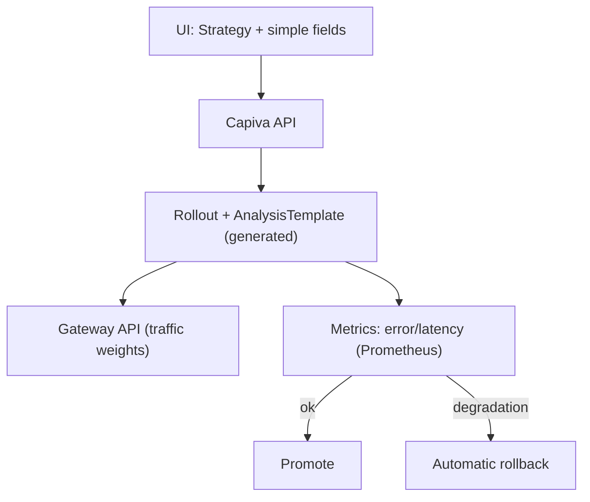

# 13 — Deploy Intelligence (Git, CI/CD, Progressive Delivery)

## Native Git Integration

- Providers: **GitHub, GitLab, Gitea** (Strategy `IGitProvider`).
- During project creation: select **repository** and **deployment branch** (`main`, `production`, etc.).
- Continuous monitoring via **Webhooks**. Events: Push, Pull/Merge Request, Branch/Tag Creation, Release.
- Webhooks validated via signature/secret.

---

## Automatic Deploy



Same flow for GitHub PRs, GitLab MRs and Gitea PRs. No user intervention.

---

## Commit → Production Traceability

```
Commit → Build → Image → Deploy → Pods → Traffic
```

For each commit:

- author
- branch
- PR
- status (Production / Staging / Not deployed)
- Deploy #
- running pods
- timestamp

Available views:

- production vs staging
- not deployed
- full deploy & rollback history
- average deploy time
- commit → production latency

---

## Zero-downtime

1. New version pods are created
2. Wait for readiness
3. Validate health checks
4. Gradual traffic shift
5. Reduce traffic from old pods
6. Remove old pods only after active connections drain

Users never experience downtime.

---

## Smart Rollouts (Strategies)

```mermaid
flowchart LR
    ○ Rolling Update   ○ Blue/Green   ○ Canary
```

| Strategy       | Behavior                                              |
| -------------- | ----------------------------------------------------- |
| Rolling Update | gradual pod replacement                               |
| Blue/Green     | isolated new version, instant switch after validation |
| Canary         | progressive traffic: 5% → 25% → 50% → 100%            |

### Canary (simplified config)

- initial traffic: `10%`
- increment: `10%`
- interval: `5 min`
- automatic rollback: `[✓]`

---

## Progressive Delivery — Decision: Argo Rollouts

Comparison:

| Criterion              | Custom Implementation | Argo Rollouts           |
| ---------------------- | --------------------- | ----------------------- |
| Reliability            | low                   | high                    |
| Canary / Blue-Green    | manual                | native                  |
| Metrics-based rollback | complex               | AnalysisTemplate native |
| Traffic integration    | manual                | native (Gateway API)    |
| Maintenance cost       | high                  | low                     |

**Decision:** adopt **Argo Rollouts** and fully abstract it away.

The user only sees:

- deployment strategy
- simple parameters

Internally:

- Rollout
- AnalysisTemplate
- Experiment

---



---

## Smart Rollback

Triggered by:

- health check failure
- error rate increase
- latency spike
- crash loops
- startup failure

Result:

- traffic switched back to previous version
- deployment marked as failed
- automatic rollback executed

---

## Deployment Timeline (GitHub Actions style)

```
15:42 Commit Received   15:46 Deploy Started   15:49 Traffic Shifted
15:43 Build Started     15:47 Pods Created     15:50 Deploy Finished
15:45 Image Published   15:48 Health OK
```

Powered by `DeploymentEvent` (searchable & auditable).

---

## Release Tracking

Full trace:

```
User → Request → Pod → Deployment → Image → Commit → Pull Request
```

Collected via:

- cluster annotations/labels
- OpenTelemetry

---

## Preview Deployments

Out of MVP scope (does not block architecture).

Challenges:

- infrastructure cloning
- data replication
- isolation
- cost control
- safe migrations

Already supported structurally via:

- `Environment`
- `Deployment`

---
