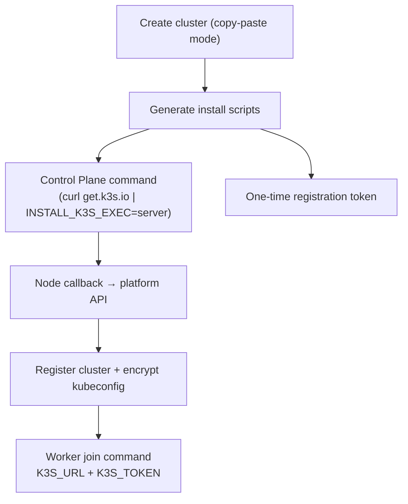
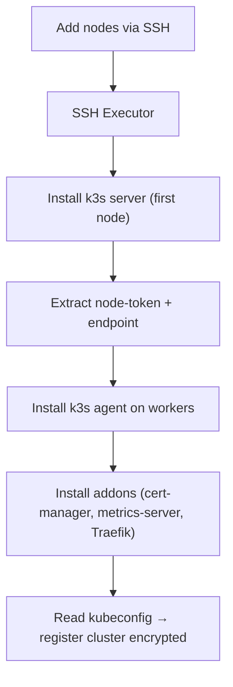

### # 17 — Cluster Provisioning & Management (SSH / Auto-Deploy)

> Requirement: the platform must be able to **spin up its own Kubernetes cluster**, register itself automatically, and manage nodes (add/remove control plane and workers). A full cluster control panel. No hand-waving.

---

## Objective

The user does **not need to know Kubernetes installation**.

They only:

1. Provide **SSH access** to nodes (host + user + key/password), **or**
2. Copy-paste a **single command** into each node terminal.

The platform then:

- installs the **control plane**
- joins **worker nodes**
- installs core addons (Traefik ingress, cert-manager, metrics-server)
- **registers the cluster inside itself**
- starts operating in real mode (no simulation)

---

## Chosen distribution: **k3s**

- Lightweight, production-grade Kubernetes distribution
- Single binary install
- Built-in Traefik + service load balancer
- Simple join flow (`server URL + node token`)
- Ideal for self-host / bare metal / VM environments

---

## Provisioning modes

### A) Copy-paste mode (no stored SSH credentials)

Platform generates commands for each node.

- Control plane bootstraps first
- Sends **one-time registration callback**
- Platform stores encrypted kubeconfig + cluster metadata
- Workers join after server is ready

---

### B) SSH mode (fully automated)

User registers nodes with SSH credentials.

- All credentials stored encrypted at rest (AES-256-GCM)
- Execution streamed live (logs per step)
- Idempotent provisioning (safe retry)

---

## Node management capabilities

| Action                 | Implementation                            |
| ---------------------- | ----------------------------------------- |
| Add worker             | Generate join script or SSH install agent |
| Add control plane (HA) | k3s server with embedded etcd             |
| Remove node            | drain → delete node → uninstall k3s       |
| Cordon/Uncordon        | kubectl cordon / uncordon                 |
| View node usage        | metrics-server (Fleet view UI)            |

---

## Data model additions

- `ClusterNode`
  - `role`: CONTROL_PLANE | WORKER
  - `host`, `sshUser`, `sshKeyCipher`
  - `status`: provisioning | ready | draining | removed
  - `internalIp`

- `ProvisioningTask`
  - async job tracking install/join/remove
  - logs streamable via SSE/WebSocket

- `Cluster.provisioner`
  - `MANUAL | SSH | COPY_PASTE`

- `registrationToken`
  - single-use bootstrap token (copy-paste mode)

---

## Backend components

### `SSHExecutor`

- Runs remote commands
- Streams logs in real-time
- Timeout + retry safe
- Used for install / drain / uninstall

### `ClusterProvisionerService`

Handles full lifecycle:

- install control plane
- join workers
- install addons
- register cluster

### `NodeManagementService`

- add/remove/drain nodes
- cordon/uncordon
- wraps KubernetesAdapter + SSHExecutor

---

## Real-world validation strategy

No fake cluster assumptions.

1. **k3d (local dev)**
   - fast validation
   - simulate multi-node cluster

2. **k3s on VM / bare metal**
   - real SSH provisioning path
   - production-like behavior

3. Unit tests only mock SSH layer
   - everything else must hit real Kubernetes API

---

## Roadmap insertion (pre-Final phase)

1. Add `ClusterNode` + `ProvisioningTask`
2. Implement script generator (k3s server/agent)
3. Implement copy-paste bootstrap + callback registration
4. Build SSH provisioning pipeline
5. Node management UI (add/drain/cordon/remove)
6. Validate on k3d + real VM cluster

---
